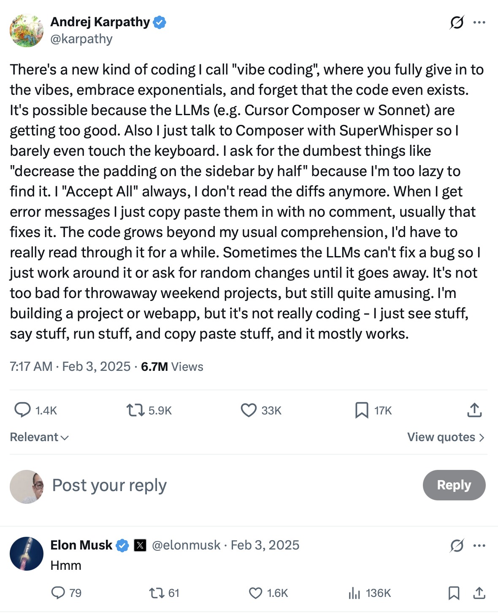
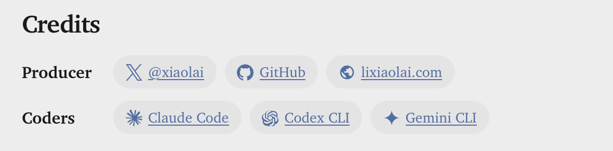

# Why I Built a Markdown Editor: VMark

::: info TL;DR
A non-programmer started vibe coding in August 2025 and built VMark — a Markdown editor — in six weeks. Key lessons: **git is mandatory** (it's your undo button), **TDD keeps AI honest** (tests are boundaries against bugs), **you are vibe thinking, not vibe coding** (AI does the labor, you do the judgment), and **cross-model debate beats single-model trust**. The journey proved that users can become developers — but only if they invest in a few foundational skills.
:::

## How It Started

In truth, building VMark has primarily been a learning and experiential journey for myself.

I began experimenting with the emerging programming trend known as *vibe coding* on August 17, 2025. The term *vibe coding* itself was first coined and circulated on February 2, 2025, originating from a post by Andrej Karpathy on [X](https://x.com/karpathy/status/1886192184808149383) (formerly Twitter).

Andrej Karpathy is a highly influential researcher and educator in the field of machine learning. He has held important positions at companies such as OpenAI and Tesla, and later founded Eureka Labs, focusing on AI-native education. His tweet not only introduced the concept of "vibe coding," but also spread rapidly through the tech community, sparking extensive follow-up discussions.

By the time I noticed and started using vibe coding tools, nearly half a year had already passed. At that time, Claude Code was still at version [1.0.82](https://github.com/anthropics/claude-code/commit/b1751f2). As I write this document on February 9, 2026, it has reached version [2.1.37](https://github.com/anthropics/claude-code/commit/85f28079913b67a498ce16f32fd88aeb72a01939), having gone through 112 version updates in between.

At the very beginning, I only used these tools to enhance some automation scripts I had written long ago — for example, batch-translating ebooks. What I realized was that I was merely amplifying abilities I already had.

If I already knew how to do something, AI helped me do it better. If I didn't know how to do something, AI often gave me the illusion that I could — usually with an initial "wow" moment — followed by nothing. What I originally couldn't do, I still couldn't do. Those beautiful images, eye-catching videos, and long-form articles were, in many cases, just another form of "Hello World" for a new era.[^1]

I am not completely ignorant of programming, but I am certainly not a real computer engineer. At best, I am a power user among ordinary users. I know some code, and I have even published a book about Python programming. But that does not make me an engineer. It's like someone who can build a thatched hut: they know more than someone who can't, but they are not even remotely in the same category as those who design skyscrapers or bridges.

And then, AI changed everything.

## From Scripts to Software

From the beginning until now, I have tried almost every AI coding CLI available: Claude Code, Codex CLI, Gemini CLI, even unofficial tools like Grok CLI, as well as open-source alternatives such as Aider. Yet the one I have used the most is always Claude Code. After Codex CLI introduced an MCP Server, I used Claude Code even more, because it could call Codex CLI directly in Interactive Mode. Ironically, although Claude Code was the first to propose the MCP protocol, it still does not provide an MCP Server itself (as of 2026-02-10).

At first, Claude Code felt like a professional IT specialist who had suddenly moved into my home — someone you would normally only find in large companies. Anything computer-related could be handed over to it. It would solve problems using command-line tools I had never seen before, or familiar commands used in unfamiliar ways.

As long as it was given sufficient permissions, there was almost nothing it couldn't do: system maintenance, updates, networking, deploying software or services with countless tricky configurations and conflicts. You could never hire a person like this for USD 200 a month.

After that, the number of machines I used began to increase. Cloud instances grew from one or two to five or six; machines at home increased from two or three to seven or eight. Problems that used to take days to set up — and often failed due to my limited knowledge — suddenly disappeared. Claude Code handled all machine operations for me, and after fixing issues, it even wrote auto-start scripts to ensure the same problems would never occur again.

Then I started writing things I had never been able to write before.

First came a browser extension called **Insidebar-ai**, designed to reduce constant context switching and copy-pasting in the browser. Then came **Tepub**, which actually looked like real software: a Python command-line tool for translating EPUB books (monolingual or bilingual) and even generating audiobooks. Before that, all I had were clumsy, handwritten Python scripts.

I felt like a fashion blogger who had suddenly acquired tailoring skills — or even owned a textile factory. Regardless of how good my taste once was, once I inadvertently learned more about related and foundational fields, many of my views naturally — and unavoidably — changed.

I decided to spend several years turning myself into a real computer engineer.

I had done something similar before. I taught reading classes at New Oriental for many years. After teaching for several years, at least in reading, I had effectively turned myself into an English native reader (not speaker). My speaking was terrible — but there was no real use for it anyway — so that was that.

I wasn't aiming for anything grand. I just wanted to exercise my brain. It's the most interesting game, isn't it?

I decided to complete one relatively small project every week, and one relatively larger project every month. After dozens of projects, I guessed I would become a different person.

Three months later, I had built more than a dozen projects — some failed, some were abandoned — but all were fascinating. During this process, AI became visibly smarter at an astonishing pace. Without dense, hands-on usage, you would never really feel this; at most, you'd hear about it secondhand. This feeling matters, because it directly shaped an AI philosophy I'll discuss later: **a firm belief that AI will keep getting smarter**.

In November 2025, I built an EPUB reader based on foliate.js, designed exactly the way I liked it. I implemented features I couldn't get on Kindle or Apple Books (macOS/iOS): layered highlights, highlight and note management (not just export), custom dictionaries, exporting Obsidian cards, and more. There were occasional bugs, but they didn't affect my personal use.

That said, I was too embarrassed to release it publicly. The biggest lesson I learned was this: something built only for yourself is a *toy*; something built for many people is a *product* or a *service*.

## Why a Markdown Editor

Naturally, I was still only thinking about my own needs. Once "reading" was solved, the next thing I could solve for myself was "writing." So on December 27, 2025 — after returning to Beijing from Harbin after Christmas — I started building **VMark**. The name simply means *Vibe-coded Markdown Editor*. Even its icon was vibe-coded: Claude Code instructed Sketch via MCP to draw it.

Choosing to build a Markdown editor had other reasons as well.

> - I felt I had a fairly clear idea of what a Markdown editor *should* be like.
>
> - I also had many unmet needs that existing editors failed to satisfy.
>
> - Intuitively, it felt like a project of just the right size for me at this stage — a "medium-sized" project I could realistically handle.
>
> - I also believed such a project would allow AI to help me more. After all, a Markdown editor is nothing new; every detail of it is something AI understands better than almost anyone.

And then I fell into a hole — a very deep one. A truly good Markdown editor is extremely difficult to build, far more complex than I had imagined.

I was superficially happy for a few days, then spent a week repeatedly struggling and feeling dejected. Eventually, I asked ChatGPT:

> How big is the workload for building a really good Markdown editor?

The opening of its reply made me laugh — at my own ignorance.

> - A usable Markdown editor: **1 person · 1–2 weeks**
>
> - A good Markdown editor: **1–2 people · 1–3 months**
>
> - A Markdown editor heavy writers can't live without:\
>   **3–8 people · 1–3 years** (and essentially a continuously evolving project)
>
> - (Many details omitted.)
>
> - Then came the final question:\
>   *How long are you willing to maintain it (in years, not months)?*

That actually reassured me. Maintenance measured in *years*? That might be a problem for others, but not for me. I'm not afraid of that. I also had a small insight: Markdown is likely the most fundamental format for future human–computer interaction. I'll only use it more over time. If so, why not maintain it indefinitely?

As a side note, during this process I discovered that Typora — an editor I had used and paid for multiple licenses for over many years — is actually developed by a company based in Shanghai.

Two weeks later, VMark had a basic shape. One full month later, on January 27, 2026, I changed its label from *alpha* to *beta*.

## An Opinionated Editor

VMark is **highly opinionated**. In fact, I suspect all vibe-coded software and services will be. This is unavoidable, because vibe coding is inherently a production process without meetings — just me and an executor who never argues back.

Here are a few of my personal preferences:

> - All non-content information must stay out of the main area. Even the formatting menu is placed at the bottom.
>
> - I have stubborn typographic preferences.
>
> - Chinese characters must have spacing between them, but English letters embedded in Chinese text must not. Before VMark, no editor satisfied this niche, commercially worthless requirement.
>
> - Line spacing must be adjustable at any time.
>
> - Tables must only have background color on the header row. I hate zebra stripes.
>
> - Tables and images should be centerable.
>
> - Only H1 headings should have underlines.

Some features typically found only in code editors must exist:

> - Multi-cursor mode
>
> - Multi-line sorting
>
> - Automatic punctuation pairing

Others are optional, but nice to have:

> - Tab Right Escape
>
> - I like WYSIWYG Markdown editors, but I hate constantly switching views (even though it's sometimes necessary). So I designed a *Source Peek* feature (F5), allowing me to view and edit the source of the current block without switching the entire view.
>
> - Exporting PDF isn't that important. Exporting dynamic HTML is.

And so on.

## Mistakes and Breakthroughs

During development, I made countless mistakes, including but not limited to:

> - Implementing complex features too early, unnecessarily inflating scope
>
> - Spending time on features that were later removed
>
> - Hesitating between paths, restarting again and again
>
> - Following a path for too long before realizing I lacked guiding principles

In short, I experienced every mistake an immature engineer can make — many times over. One result was that from morning until night, I stared at a screen almost nonstop. Painful, yet joyful.

Of course, there were things I did right.

For example, I added an MCP Server to VMark before its core features were even solid. This allowed AI to send content directly into the editor. I could simply ask Claude Code in the terminal:

> "Provide Markdown content for testing this feature, with comprehensive coverage of edge cases."

Every time, the generated test content amazed me — and saved enormous time and energy.

At first, I had no idea what MCP really was. I only came to understand it deeply after cloning an MCP server and modifying it into something entirely unrelated to VMark — leading to another project called **CCCMemory**. Vibe learning, indeed.

In real usage, having MCP in a Markdown editor is incredibly useful — especially for drawing Mermaid diagrams. No one understands those better than AI. The same goes for regular expressions. I now routinely ask AI to send its output — analysis reports, audit reports — directly into VMark. It's far more comfortable than reading them in a terminal or VSCode.

By February 2, 2026 — exactly one year after the birth of the vibe coding concept — I felt VMark had become a tool I could genuinely use comfortably. It still had many bugs, but I had already started writing with it daily, fixing bugs along the way.

I even added a command-line panel and AI Genies (honestly, not very usable yet, due to quirks of different AI providers). Still, it was clearly on a path where it kept getting better for me — and where I could no longer use other Markdown editors.

## Git Is Mandatory

Six weeks in, I felt there were some details worth sharing with other "non-engineers" like myself.

First, although I'm not a real engineer, thankfully I understand basic **git** operations. I've used git for many years, even though it seems like a tool only engineers use. Looking back, I think I registered my GitHub account about 15 years ago.

I rarely use advanced git features. For example, I don't use git worktree as recommended by Claude Code. Instead, I use two separate machines. I only use basic commands, all issued via natural language instructions to Claude Code.

Everything happens on branches. I mess around freely, then say:

> "Summarize the lessons learned so far, reset the current branch, and let's start over."

Without git, you simply can't do any non-trivial project. This is especially important for non-programmers: *learning basic git concepts is mandatory*. You'll naturally learn more just by watching Claude Code work.

Second, you must understand the **TDD** workflow. Do everything possible to improve test coverage. Understand the concept of *tests as boundaries*. Bugs are inevitable — like rice weevils in a granary. Without sufficient test coverage, you have no chance of finding them.

## Vibe Thinking, Not Vibe Coding

Here is the core philosophical principle: **you are not vibe coding; you are vibe thinking**. Products and services are always the result of *thinking*, not the inevitable outcome of *labor*.

AI has taken over much of the "*doing*," but it can only assist in the fundamental thinking of *what*, *why*, and *how*. The danger is that it will always follow your lead. If you rely on it for thinking, it will quietly trap you inside your own cognitive biases[^2] — while making you feel freer than ever. As the lyric goes:

> *"We are all just prisoners here, of our own device."*

What I often say to AI is:

> "Treat me as a rival you don't particularly like. Evaluate my ideas critically and challenge them directly, but keep it professional and non-hostile."

> The results are consistently high-quality and unexpected.

Another technique is to let AIs from different vendors debate each other.[^3] I installed Codex CLI's MCP service for Claude Code. I often tell Claude Code:

> "Summarize the problems you couldn't solve just now and ask Codex for help."

Or I send Claude Code's plan to Codex CLI:

> "This is the plan drafted by Claude Code. I want your most professional, blunt, and unsparing feedback."

Then I feed Codex's response back to Claude Code.

When I discovered Claude Code's `/audit` command (around early October), I immediately wrote `/codex-audit` — a clone that uses MCP to call Codex CLI. Using AI to pressure and audit AI works far better than doing it myself.

This approach is essentially a variant of *recursion* — the same principle behind asking Google "how to use Google effectively." That's why I don't spend much time on complex prompt engineering. If you understand recursion, better results are inevitable.

## Terminal Only

There's also a personality factor. Engineers must genuinely enjoy **dealing with details**. Otherwise, the work becomes miserable. Every detail contains countless sub-details.

For example: curly quotes vs straight quotes; how noticeable curly quotes are depends on the Latin fonts rather than CJK fonts (something I never knew before VMark); if quotes auto-pair, right double quotes must auto-pair too (a detail I noticed while writing this very article); meanwhile, right curly single quotes should *not* auto-pair. If handling these details doesn't make you happy, product development will inevitably become boring, frustrating, and even infuriating.

Finally, there's one more highly opinionated choice worth mentioning. Because I'm not an engineer, I chose what I believe is the more correct path out of necessity:

**I use no IDE at all** — **only the terminal.**

At first, I used the default macOS Terminal. Later, I switched to iTerm for tabs and split panes.

Why abandon IDEs like VSCode? Initially, because I couldn't understand complex code — and Claude Code often caused VSCode to crash. Later, I realized I didn't need to understand it. AI-written code is vastly better than what I — or even programmers I could afford to hire (OpenAI's scientists aren't people you can hire) — could write. If I don't read the code, there's no need to read diffs either.

Eventually, I stopped writing documentation myself (guidance is still necessary). The entire [vmark.app](https://vmark.app) website was written by AI; I didn't touch a single character — except for reflections on vibe coding itself.

It's similar to how I invest: I *can* read financial statements, but I never do — good companies are obvious without them. What matters is the direction, not the details.

That's why the VMark website includes this credit:

Another consequence of being highly opinionated: even if VMark is open-sourced, community contributions are unlikely. It's built purely for my own workflow; many features have little value for others. More importantly, a Markdown editor is not cutting-edge technology. It's one of countless implementations of a familiar tool. AI can solve virtually any problem related to it.

Claude Code can even read GitHub issues, fix bugs, and automatically reply in the reporter's language. The first time I saw it handle an issue end-to-end, I was completely stunned.

## The Litmus Test

Building VMark also made me think about the broader implications of AI for learning. All education should be production-oriented[^4] — the future belongs to creators, thinkers, and decision-makers, while execution belongs to machines. The most important litmus test for anyone using AI:

> After you start using AI, are you thinking **more**, or **less**?

If you're thinking more — and thinking deeper — then AI is helping you in the right way. If you're thinking less, then AI is producing side effects.[^5]

Also, AI is never a tool for "doing less work." The logic is simple: because it can do more things, you can think more and go deeper. As a result, the things you *can* do — and *need* to do — will only **increase**, not decrease.[^6]

While writing this article, I casually discovered several small issues. As a result, VMark's version number went from **0.4.12** to **0.4.13**.

And since I've started living primarily in the command line, I no longer feel any need for a large monitor or multiple screens. A 13-inch laptop is completely sufficient. Even a small balcony can become an "enough" workspace.

[^1]: A randomized controlled trial by METR found that experienced open-source developers (averaging 5 years on their assigned projects) were actually **19% slower** when using AI tools, despite predicting a 24% speedup. The study highlights a gap between perceived and actual productivity gains — AI helps most when amplifying existing skills, not substituting for missing ones. See: Rao, A., Brokman, J., Wentworth, A., et al. (2025). [Measuring the Impact of Early-2025 AI on Experienced Open-Source Developer Productivity](https://arxiv.org/abs/2507.09089). *METR Technical Report*.

[^2]: LLMs trained with human feedback systematically agree with users' existing beliefs rather than provide truthful responses — a behavior researchers call *sycophancy*. Across five state-of-the-art AI assistants and four text-generation tasks, models consistently tailored responses to match user opinions, even when those opinions were incorrect. When a user merely suggested an incorrect answer, model accuracy dropped significantly. This is exactly the "cognitive bias trap" described above: AI follows your lead rather than challenging you. See: Sharma, M., Tong, M., Korbak, T., et al. (2024). [Towards Understanding Sycophancy in Language Models](https://arxiv.org/abs/2310.13548). *ICLR 2024*.

[^3]: This technique mirrors a research approach called *multi-agent debate*, where multiple LLM instances propose and challenge each other's responses over several rounds. Even when all models initially produce incorrect answers, the debate process significantly improves factuality and reasoning accuracy. Using models from different vendors (with different training data and architectures) amplifies this effect — their blind spots rarely overlap. See: Du, Y., Li, S., Torralba, A., Tenenbaum, J.B., & Mordatch, I. (2024). [Improving Factuality and Reasoning in Language Models through Multiagent Debate](https://arxiv.org/abs/2305.14325). *ICML 2024*.

[^4]: This aligns with Seymour Papert's theory of *constructionism* — the idea that learning is most effective when learners are actively constructing meaningful artifacts rather than passively absorbing information. Papert, a student of Piaget, argued that building tangible products (software, tools, creative works) engages deeper cognitive processes than traditional instruction. John Dewey made a similar case a century earlier: education should be experiential and connected to real-world problem-solving rather than rote memorization. See: Papert, S. & Harel, I. (1991). [Constructionism](https://web.media.mit.edu/~calla/web_comunidad/Reading-En/situating_constructionism.pdf). *Ablex Publishing*; Dewey, J. (1938). *Experience and Education*. Kappa Delta Pi.

[^5]: A 2025 study of 666 participants found a strong negative correlation between frequent AI tool usage and critical thinking abilities (r = −0.75), mediated by *cognitive offloading* — the tendency to delegate thinking to external tools. The more participants relied on AI, the less they engaged their own analytical faculties. Younger participants showed higher AI dependence and lower critical thinking scores. See: Gerlich, M. (2025). [AI Tools in Society: Impacts on Cognitive Offloading and the Future of Critical Thinking](https://www.mdpi.com/2075-4698/15/1/6). *Societies*, 15(1), 6.

[^6]: This is a modern instance of *Jevons paradox* — the 1865 observation that more efficient steam engines did not reduce coal consumption but increased it, because lower costs stimulated greater demand. Applied to AI: as coding and writing become cheaper and faster, the total volume of work expands rather than contracts. Recent data supports this — demand for AI-fluent software engineers surged nearly 60% year-over-year in 2025, with compensation premiums of 15–25% for developers proficient in AI tools. Efficiency gains create new possibilities, which create new work. See: Jevons, W.S. (1865). *The Coal Question*; [The Productivity Paradox of AI](https://www.hackerrank.com/blog/the-productivity-paradox-of-ai/), HackerRank Blog (2025).
