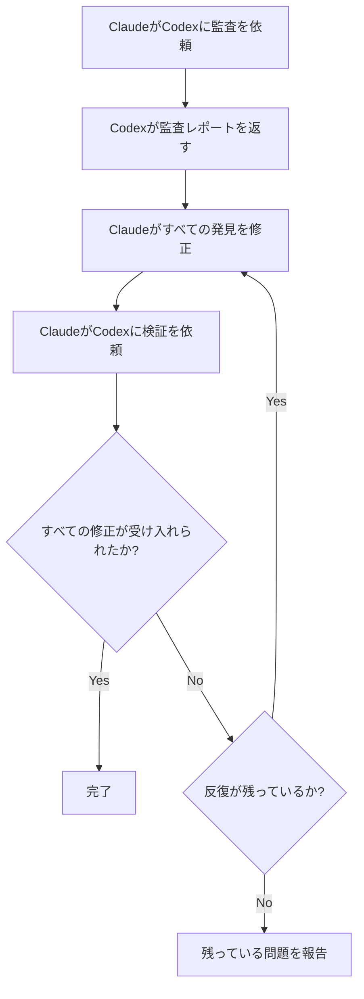

# クロスモデル検証

VMarkは互いに挑戦し合う2つのAIモデルを使用しています: **Claudeがコードを書き、Codexがそれを監査します**。この敵対的セットアップにより、単一モデルでは見落とすバグを捉えます。

## なぜ2つのモデルが1つより優れているのか

すべてのAIモデルには盲点があります。あるカテゴリのバグを一貫して見落としたり、より安全な代替品よりも特定のパターンを好んだり、自分の仮定を疑わないことがあります。同じモデルがコードを書いてレビューすると、それらの盲点は両方のパスで生き残ります。

クロスモデル検証はこれを打ち破ります:

1. **Claude**（Anthropic）が実装を書きます — 完全なコンテキストを理解し、プロジェクトの規約に従い、TDDを適用します。
2. **Codex**（OpenAI）が独立して結果を監査します — 新鮮な目でコードを読み、異なるデータで訓練され、異なる失敗モードを持ちます。

モデルは真に異なります。それらは別々のチームによって構築され、異なるデータセットで訓練され、異なるアーキテクチャと最適化目標を持ちます。両方がコードが正しいと同意すると、単一モデルの「大丈夫に見える」より信頼性がはるかに高くなります。

研究は複数の角度からこのアプローチを支持しています。マルチエージェントディベート — 複数のLLMインスタンスが互いの応答に挑戦 — は事実性と推論精度を大幅に改善します[^1]。ロールプレイプロンプティング（モデルに特定の専門家の役割を割り当てる）は推論ベンチマークで標準的なゼロショットプロンプティングを一貫して上回ります[^2]。最近の研究では、最先端のLLMが評価されていることを検出して動作を調整できることが示されています[^3] — これは別のAIによって詳細に調べられることを知っているモデルが、より慎重で媚びのない作業を生み出す可能性が高いことを意味します[^4]。

### クロスモデルが捉えるもの

実際には、2番目のモデルは次のような問題を見つけます:

- 最初のモデルが自信を持って導入した**ロジックエラー**
- 最初のモデルが考慮しなかった**エッジケース**（null、空、Unicode、並行アクセス）
- リファクタリング後に残った**デッドコード**
- 一方のモデルのトレーニングがフラグを立てなかった**セキュリティパターン**（パストラバーサル、インジェクション）
- 書くモデルが合理化してしまった**規約違反**
- モデルが微妙なエラーでコードを複製した**コピーペーストバグ**

これは人間のコードレビューの原則と同じです — 2つ目の目がコードを書いた人には見えないものを捉えます — ただし両方の「レビュアー」と「著者」が疲れ知らずで、コードベース全体を数秒で処理できます。

## VMark での動作方法

### Codex Toolkitプラグイン

VMark は`codex-toolkit@xiaolai` Claude Codeプラグインを使用しており、CodexをMCPサーバーとしてバンドルします。プラグインが有効化されると、Claude Codeは自動的に`codex` MCPツールにアクセスできます — CodexにプロンプトをGOODして構造化された応答を受け取るためのチャンネル。Codexは**サンドボックス化された読み取り専用コンテキスト**で実行されます: コードベースを読めますがファイルを変更できません。すべての変更はClaudeが行います。

### セットアップ

1. Codex CLIをグローバルにインストールして認証:

```bash
npm install -g @openai/codex
codex login                   # ChatGPTサブスクリプションでログイン（推奨）
```

2. Claude Codeにcodex-toolkitプラグインをインストールして有効化:

```bash
claude plugin install codex-toolkit@xiaolai --scope project
```

3. Codexが利用可能か確認:

```bash
codex --version
```

それだけです。プラグインはCodex MCPサーバーを自動的に登録します — 手動での`.mcp.json`エントリーは不要。

::: tip サブスクリプション vs API
劇的に低いコストのために`OPENAI_API_KEY`の代わりに`codex login`（ChatGPTサブスクリプション）を使用してください。[サブスクリプション vs APIプライシング](/ja/guide/users-as-developers/subscription-vs-api)をご覧ください。
:::

::: tip macOS GUIアプリのPATH
macOS GUIアプリは最小限のPATHを持ちます。`codex --version`がターミナルで動作するのにClaude Codeが見つけられない場合、Codexバイナリの場所をシェルプロフィール（`~/.zshrc`または`~/.bashrc`）に追加してください。
:::

::: tip プロジェクト設定
`/codex-toolkit:init`を実行してプロジェクト固有のデフォルト（監査フォーカス、努力レベル、スキップパターン）を含む`.codex-toolkit.md`設定ファイルを生成します。
:::

## スラッシュコマンド

`codex-toolkit`プラグインはClause + Codexのワークフローを調整する事前構築されたスラッシュコマンドを提供します。インタラクションを手動で管理する必要はありません — コマンドを呼び出すだけで、モデルが自動的に調整します。

### `/codex-toolkit:audit` — コード監査

主要な監査コマンド。2つのモードをサポートします:

- **Mini（デフォルト）** — 高速5次元チェック: ロジック、重複、デッドコード、リファクタリング債務、ショートカット
- **Full（`--full`）** — 徹底的な9次元監査でセキュリティ、パフォーマンス、準拠、依存関係、ドキュメントを追加

| 次元 | チェック内容 |
|-----------|---------------|
| 1. 冗長コード | デッドコード、重複、未使用のインポート |
| 2. セキュリティ | インジェクション、パストラバーサル、XSS、ハードコードされたシークレット |
| 3. 正確さ | ロジックエラー、競合状態、null処理 |
| 4. 準拠 | プロジェクトの規約、Zustandパターン、CSSトークン |
| 5. 保守性 | 複雑さ、ファイルサイズ、命名、インポートの健全性 |
| 6. パフォーマンス | 不必要な再レンダリング、ブロッキング操作 |
| 7. テスト | カバレッジのギャップ、欠落しているエッジケーステスト |
| 8. 依存関係 | 既知のCVE、設定セキュリティ |
| 9. ドキュメント | 欠落しているドキュメント、古いコメント、ウェブサイトの同期 |

使い方:

```
/codex-toolkit:audit                  # コミットされていない変更についてのMini監査
/codex-toolkit:audit --full           # 完全な9次元監査
/codex-toolkit:audit commit -3        # 最後の3コミットを監査
/codex-toolkit:audit src/stores/      # 特定のディレクトリを監査
```

出力は重大度評価（重大/高/中/低）とすべての発見に対する修正提案を含む構造化されたレポートです。

### `/codex-toolkit:verify` — 以前の修正を検証

監査の発見を修正した後、Codexに修正が正しいことを確認してもらいます:

```
/codex-toolkit:verify                 # 最後の監査からの修正を検証
```

Codexは報告された場所の各ファイルを再読み取りし、各問題を修正済み、未修正、または部分的に修正済みとしてマークします。また、修正によって導入された新しい問題をスポットチェックします。

### `/codex-toolkit:audit-fix` — 完全なループ

最も強力なコマンド。監査 → 修正 → 検証をループでチェーンします:

```
/codex-toolkit:audit-fix              # コミットされていない変更でループ
/codex-toolkit:audit-fix commit -1    # 最後のコミットでループ
```

何が起こるか:



ループはCodexがすべての重大度でゼロの発見を報告したとき、または3回の反復後（残りの問題があなたに報告される）に終了します。

### `/codex-toolkit:implement` — 自律的な実装

Codexにプランを送って完全な自律的実装:

```
/codex-toolkit:implement              # プランから実装
```

### `/codex-toolkit:bug-analyze` — 根本原因分析

ユーザーが説明したバグの根本原因分析:

```
/codex-toolkit:bug-analyze            # バグを分析
```

### `/codex-toolkit:review-plan` — プランレビュー

アーキテクチャレビューのためにCodexにプランを送る:

```
/codex-toolkit:review-plan            # 一貫性とリスクのためにプランをレビュー
```

### `/codex-toolkit:continue` — セッションを続ける

発見について反復するために以前のCodexセッションを続ける:

```
/codex-toolkit:continue               # 中断したところから続ける
```

### `/fix-issue` — エンドツーエンドのIssue解決者

このプロジェクト固有のコマンドはGitHub Issueの完全なパイプラインを実行します:

```
/fix-issue #123               # 単一のIssueを修正
/fix-issue #123 #456 #789     # 複数のIssueを並行して修正
```

パイプライン:
1. GitHubからIssueを**取得**
2. **分類**（バグ、機能、または質問）
3. 説明的な名前での**ブランチ**作成
4. TDDでの**修正**（RED → GREEN → REFACTOR）
5. **Codex監査ループ**（最大3ラウンドの監査 → 修正 → 検証）
6. **ゲート**（`pnpm check:all` + Rustが変更された場合は`cargo check`）
7. 構造化された説明での**PR**作成

クロスモデル監査はステップ5に組み込まれています — すべての修正がPRが作成される前に敵対的レビューを受けます。

## 特化エージェントとプランニング

監査コマンドを超えて、VMarkのAI設定には上位レベルのオーケストレーションが含まれます:

### `/feature-workflow` — エージェント駆動の開発

複雑な機能のために、このコマンドは特化サブエージェントのチームを展開します:

| エージェント | 役割 |
|-------|------|
| **プランナー** | ベストプラクティスを調査し、エッジケースをブレインストーミングし、モジュール式のプランを生成 |
| **仕様ガーディアン** | プロジェクトルールと仕様に対してプランを検証 |
| **影響アナリスト** | 最小限の変更セットと依存関係エッジをマップ |
| **実装者** | プリフライト調査付きのTDD駆動実装 |
| **監査者** | 正確さとルール違反についてdiffをレビュー |
| **テストランナー** | ゲートを実行し、E2Eテストを調整 |
| **検証者** | リリース前の最終チェックリスト |
| **リリーススチュワード** | コミットメッセージとリリースノート |

使い方:

```
/feature-workflow sidebar-redesign
```

### プランニングスキル

プランニングスキルは以下を含む構造化された実装プランを作成します:

- 明示的な作業アイテム（WI-001、WI-002、...）
- 各アイテムの受け入れ基準
- 最初に書くテスト（TDD）
- リスク軽減とロールバック戦略
- データ変更が含まれる場合の移行プラン

プランは実装中の参照のために`dev-docs/plans/`に保存されます。

## アドホックなCodex相談

構造化されたコマンドを超えて、いつでもClaudeにCodexに相談するよう頼めます:

```
あなたの問題をまとめて、Codexに助けを求めてください。
```

Claudeは質問を作成し、MCP経由でCodexに送り、応答を組み込みます。これはClaudeが問題で詰まっているときや、アプローチについてセカンドオピニオンが欲しいときに役立ちます。

より具体的にすることもできます:

```
このZustandパターンが古い状態を引き起こす可能性があるかどうかをCodexに尋ねてください。
```

```
このマイグレーションのSQLをエッジケースについてCodexにレビューしてもらってください。
```

## フォールバック: Codexが利用できない場合

Codex MCPが利用できない場合（インストールされていない、ネットワーク問題など）、すべてのコマンドが適切に機能低下します:

1. コマンドはまずCodexに「`Respond with 'ok'`」とpingします
2. 応答がない場合: **手動監査**が自動的に開始されます
3. Claudeが各ファイルを直接読み取り、同じ次元分析を実行します
4. 監査はまだ起こります — ただしクロスモデルではなくシングルモデルです

Codexがダウンしているためにコマンドが失敗することを心配する必要はありません。常に結果を生み出します。

## 哲学

アイデアはシンプルです: **信頼するが確認する — 異なる脳で。**

人間のチームはこれを自然に行います。開発者がコードを書き、同僚がレビューし、QAエンジニアがテストします。各人が異なる経験、異なる盲点、異なるメンタルモデルをもたらします。VMarkは同じ原則をAIツールに適用します:

- **異なるトレーニングデータ** → 異なる知識のギャップ
- **異なるアーキテクチャ** → 異なる推論パターン
- **異なる失敗モード** → 一方が見落とし他方が捉えるバグ

コストは最小限（監査ごとに数秒のAPI時間）ですが、品質の改善は実質的です。VMmarkの経験では、2番目のモデルは通常最初のモデルが見落とした監査あたり2〜5の追加問題を見つけます。

[^1]: Du, Y., Li, S., Torralba, A., Tenenbaum, J.B., & Mordatch, I. (2024). [Improving Factuality and Reasoning in Language Models through Multiagent Debate](https://arxiv.org/abs/2305.14325). *ICML 2024*. 複数のLLMインスタンスがいくつかのラウンドにわたって応答を提案し議論することで、すべてのモデルが最初に間違った答えを生成しても、事実性と推論が大幅に改善されます。

[^2]: Kong, A., Zhao, S., Chen, H., Li, Q., Qin, Y., Sun, R., & Zhou, X. (2024). [Better Zero-Shot Reasoning with Role-Play Prompting](https://arxiv.org/abs/2308.07702). *NAACL 2024*. LLMにタスク固有の専門家の役割を割り当てることで、12の推論ベンチマークにわたって標準的なゼロショットとゼロショット思考の連鎖プロンプティングを一貫して上回ります。

[^3]: Needham, J., Edkins, G., Pimpale, G., Bartsch, H., & Hobbhahn, M. (2025). [Large Language Models Often Know When They Are Being Evaluated](https://arxiv.org/abs/2505.23836). 最先端モデルは評価コンテキストと実際のデプロイを区別できます（Gemini-2.5-ProはAUC 0.83に達する）。別のAIが出力をレビューすることを知っているモデルがどのように動作するかについての意味があります。

[^4]: Sharma, M., Tong, M., Korbak, T., et al. (2024). [Towards Understanding Sycophancy in Language Models](https://arxiv.org/abs/2310.13548). *ICLR 2024*. 人間のフィードバックで訓練されたLLMは、真実の応答を提供するのではなく、ユーザーの既存の信念に同意する傾向があります。評価者が人間ではなく別のAIである場合、この媚びるプレッシャーが取り除かれ、より正直で厳密な出力につながります。
